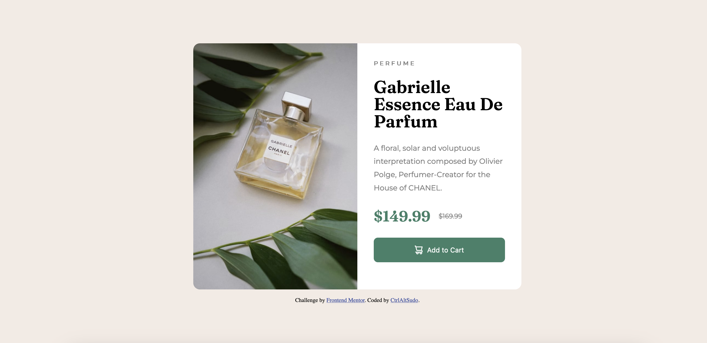

<h1 align="center">Product-preview-card-component</h1>

 <a align="center" href="https://ctrlaltsudo.github.io/FM-QR-code-component">Live Demo</a>

 <a align="center" href="https://www.frontendmentor.io/solutions/product-preview-card-component-I2MQmRTOpy">Solution Page</a>

<h2 align="center">Project Screenshot<h2>

  </img>

## Description

This is a Product preview card component challenge by Frontend Mentor, Frontend Mentor is a website that provides various web development challenges to help you develop your coding skills.

## Built with 

HTML

CSS

Flexbox

## What I learnt 
I didn't realise how much I struggled using images with flexbox, I spent way too much time trying to figure out why images were overflowing containers.

## Authors

<a href="https://github.com/CtrlAltSudo">CtrlAltSudo</a>.

## Acknowledgments

ChatGPT for giving me ideas on how to stop images from overflowing.